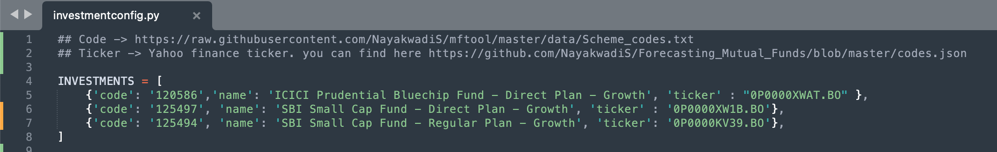
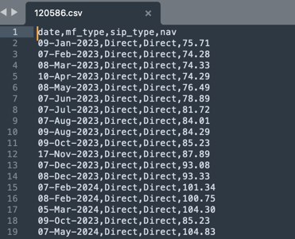
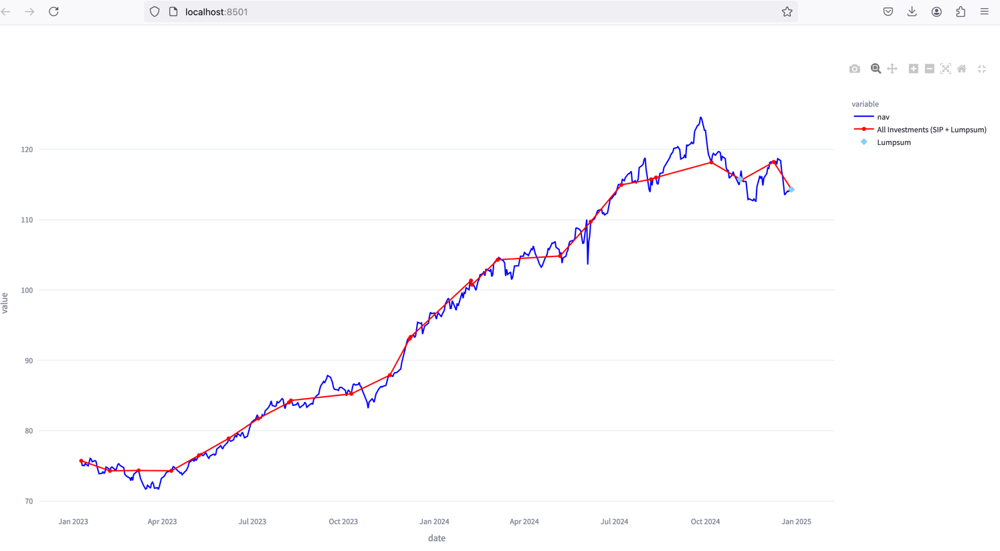

# Investment Analyser
The tool helps in analyzing mutual funds. The tool uses [mftool](https://mftool.readthedocs.io/en/latest/). 

## Requirements From Investors

The tool requires your Mutual fund's `name`, `code`, and `Yahoo ticker`. And your previous investments (SIP and Lumpsum). Your investment data should be in CSV format with columns (`date`,`mf_type`,`sip_type`,`nav`). 
Here:

1. `date` → Date for investments (more precisely your MF funding realization date)
2. `mf_type` → Regular or direct
3. `sip_type` → SIP or Lumpsum
4. `nav` → Mutual fund NAV

You will find the sample file in the `investments` folder.

#### File details:
1. All mutual funds details should be in the file `investments/investmentconfig.py`

2. And your previous investment should be in `investments/<scheme-code>.csv` as mentioned in the above format. 

It overlays your purchases with the NAV graph that helps to understand your buying patterns, like whether you are buying at a high price or a low price.

## How to Run:
### Requirements:
1. You need Python and various modules like:
   1. `mftool`
   2. `streamlit`
   3. `pandas`
   4. `plotly.express`
   5. `plotly.graph_objects`
   6. `yahooquery`
   7. `datetime`, etc
2. Install them with python pip or pip2.

### Run:
Hit the command `streamlit run mf.py` or `python3 -m streamlit run mf.py`. It will start HTTP service on localhost (http://localhost:8501/).

 

